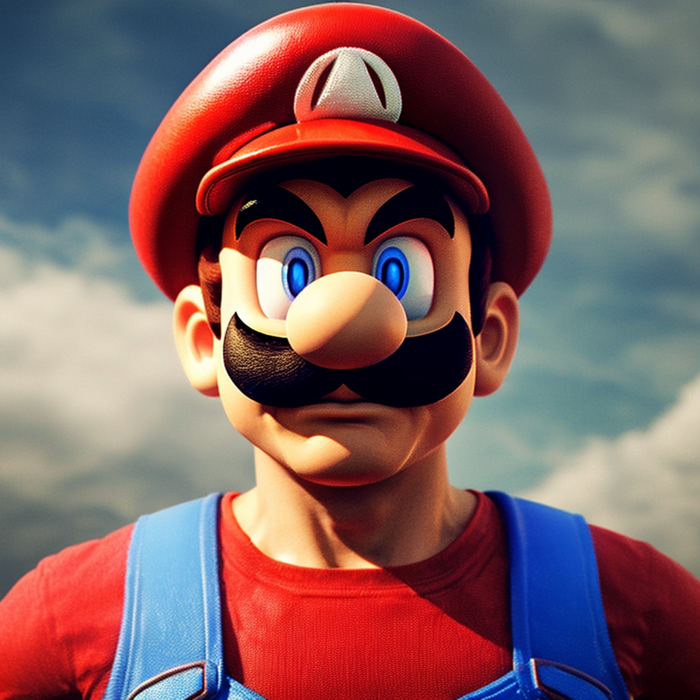
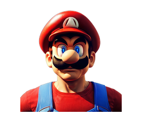
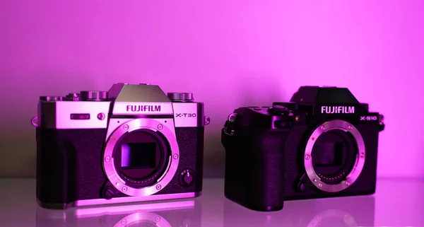
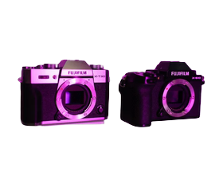
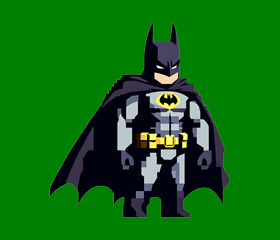
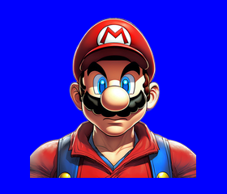
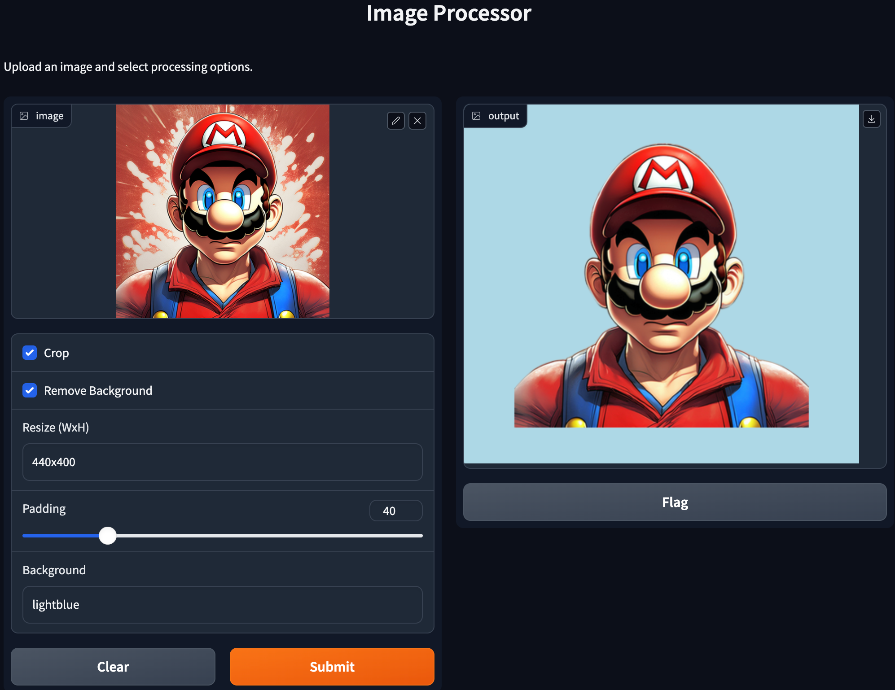

# IMAGER ___ Image Processing Script

This Python script offers a versatile image processing toolkit, allowing for operations such as background removal, autocropping, resizing, and adding padding to images. It's designed to process images in bulk, making it an ideal solution for preparing images for web use or personal projects.

[Imager Gradio App](https://huggingface.co/spaces/woodmastr/imager)

## Features

- **Background Removal**: Automatically removes the background from images.
- **Autocropping**: Crops images to remove unnecessary transparent space.
- **Resizing**: Resizes images to specified dimensions, maintaining aspect ratio.
- **Padding**: Adds padding around images, ensuring the final image size matches specified dimensions.

## Installation

To run this script, you'll need Python installed on your system along with the following packages:
- Pillow
- rembg

You can install the required packages using pip:

```sh
pip install Pillow rembg
```

# CLI Usage imager.py

Place the images you want to process in the ./input directory. The CLI command is intended for bulk processing. Run the script with desired options:

```sh
python imager.py -b -c -r 800x600 -p 10
```

## Command-Line Arguments

- `-b, --background_removal`: Enable background removal.
- `-c, --crop`: Enable autocropping.
- `-r, --resize AxB`: Resize the image to fit within AxB pixels, maintaining aspect ratio.
- `-p, --padding PIXELS`: Add PIXELS number of padding around the image. The final image size stays as specified in `-r AxB`.
- `-bg, --background BACKGROUND`: Add a background to the image. Accepts color names, hex codes, or paths to image files.

## Example
To process images by removing the background, autocropping, resizing to 800x600 pixels, and adding 10 pixels of padding:

```sh
python imager.py -b -c -r 320x280 -p 10
```

This command processes all images in the ./input directory and saves the processed images to the ./output directory.

Super Mario and Fujicamera automatically converted by imager.py: bg_removed, cropped and skaled to 320x280.  

  
  

  
  

  
### Adding a background

Let's add a blue and a green and blue background.

```sh
python imager.py -b -c -r 320x280 -p 10 -bg green
```
  
  


## Background Colors

Grayscale Monochrome Color Palette: This palette consists of different shades of gray, from light to dark, creating a simple yet effective look. The hex codes are:

| Color Name     | Hex Code |
|----------------|----------|
| Light Gray     | #D1D1D3  |
| Lavender Gray  | #C6C6C7  |
| Silver Foil    | #AFAFB0  |
| Quick Silver   | #A4A4A5  |
| Spanish Gray   | #999999  |

Feminine Soft Neutrals: This palette features warm and cozy tones, such as sand, orange, and pink, creating an inviting atmosphere. The hex codes are:

| Color Name    | Hex Code |
|---------------|----------|
| Alabaster     | #F4EEE1  |
| Dark Vanilla  | #C4BDAC  |
| Dust Storm    | #EBCFC4  |
| Pale Silver   | #D3C4BE  |
| Desert Sand   | #E9CCB1  |


Neutral Brown Color Palette: This palette offers a rich range of brown tones, from deep and dark to light and delicate, creating a sense of stability and warmth. The hex codes are:

| Color Name      | Hex Code |
|-----------------|----------|
| Café Noir       | #4E3829  |
| Coffee          | #6B513E  |
| Beaver          | #8E7766  |
| Khaki           | #B09C8D  |
| Champagne Pink  | #E6D7CE  |

# Gradio App gradio_imager.py

start the gradio app with the below command. the app can handle only one image at a time.
```sh
python gradio_imager.py
```  



# License
This project is open-source and available under the MIT License.

## Contributing

Contributions to improve the script or add new features are welcome. Please feel free to fork the repository and submit pull requests.
